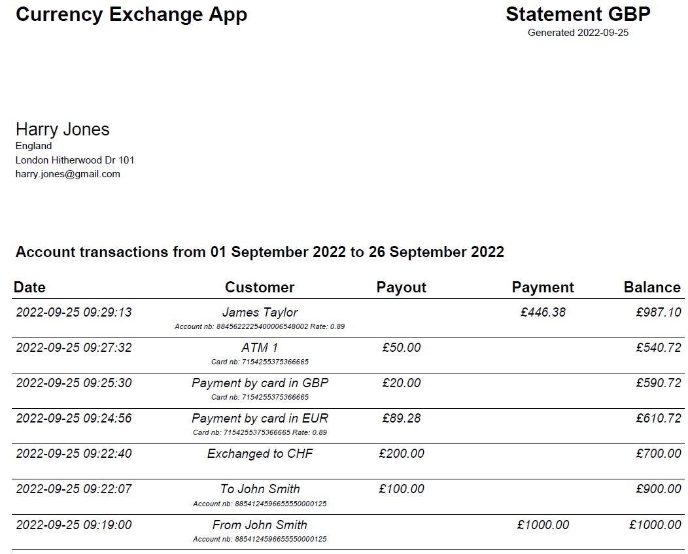

# Currency exchange app

The program simulates the operation of the Revolut application. Program operations can be performed from the terminal.

## Features

- Create a user account who will be able to perform currency exchange operations
- Encrypt the password with bcrypt
- All entered data from the terminal level will be properly validated
- All data will be saved in the mySQL database
- Connection to the base made using SQLAlchemy 2.0
- Database migrations are made by Alembic tool
- The application carries out operations using a foreign currency account and a card
- After logging in, you see the last used account or card
- The application supports operations for 4 currencies: GBP CHF USD EUR. 
- You can switch the account from which you want to carry out operations
- A foreign currency account allows us to add or transfer money to another account
- You have the option of converting money from one account to another. The application checks whether you have sufficient funds for the operation.
- You can display the last 5 transactions for a given account
- You can generate a statement for the indicated time interval. The statement can be generated as a PDF or CSV.
- You can get 3 types of cards. STANDARD, SINGLE-USE VIRTUAL, MULTI-USE VIRTUAL
- Each card has different characteristics, which will be used accordingly
- You have options to set limits on the card or to block certain transactions or block the card completely.
- The card can be removed
- If the number of transactions is exceeded, a commission will be charged
- If the card payment is made by different currencies, the currency conversion will take place
- To minimize currency conversion for all transactions, the application will look for the most optimal account
- The application downloads information about currencies from https://exchangerate.host

## Generate statement


## Prerequisites
Make sure you have the following installed on your computer:
- Python 3.10
- Docker

## Requirements
- sqlalchemy = "1.4.39"
- alembic = "1.8.1"
- bcrypt = "3.2.2"
- inflection = "0.5.1"
- mysqlclient = "2.1.1"
- requests = "2.28.1"
- openpyxl = "3.0.10"
- fpdf2 = "2.5.5"

## Setup
1. Create a database from the docker-compose.yml
```bash
$ docker-compose up -d --build
```
2. Create database tables with alembic
```bash
$ alembic upgrade +5
```
3. Install pipenv on your computer
```bash
$ pip install --user pipenv
```
4. Install the virtual environment from the pipfile
```bash
$ pipenv install --ignore-pipfile
```
5. Enter the virtual environment with the shell command
```bash
$ pipenv shell
```
6. Launch application from the console
```bash
$ python app.py
```

## Tests
1. To run tests, set up in the main application folder and call with discover
```bash
$ python -m unittest discover
```
